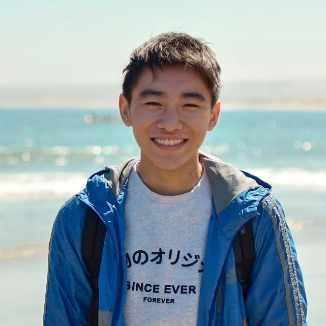

# Allen Cheung



## Directory

[About Me](https://github.com/akcheu/CSE110GitHubPages/blob/main/index.md#about-me)
[Coursework](https://github.com/akcheu/CSE110GitHubPages/blob/main/index.md#coursework)
[Programming Languages](https://github.com/akcheu/CSE110GitHubPages/blob/main/index.md#programming-languages)
[Social Media](https://github.com/akcheu/CSE110GitHubPages/blob/main/index.md#social-media)

## About Me

Hello! My name is Allen and I am a third year *Computer Engineering* major at UC San Diego. During my free time, I love to draw, paint, or play the piano. I also enjoy playing badminton or table tennis with my friends!

## Coursework

**CSE 101 - Design and Analysis of Algorithms:**
> Design and analysis of efficient algorithms with emphasis of nonnumerical algorithms such as sorting, searching, pattern matching, and graph and network algorithms. Measuring complexity of algorithms, time and storage. NP-complete problems.

**CSE 110 - Software Engineering:**
> Introduction to software development and engineering methods, including specification, design, implementation, testing, and process. An emphasis on team development, agile methods, and use of tools such as IDE’s, version control, and test harnesses.

**CSE 140 - Components and Design Techniques for Digital Systems:**
> Design of Boolean logic and finite state machines; two-level, multilevel combinational logic design, combinational modules and modular networks, Mealy and Moore machines, analysis and synthesis of canonical forms, sequential modules. 

For full course descriptions and prerequisite courses, go to [Course Catalog](https://catalog.ucsd.edu/courses/CSE.html)

## Programming Languages

**C++**

```
#include <iostream>
int main() {
    cout << "Hello World" << endl;
}
```

**Java**

```
import java.util.*
public static void main(String args[]) {
    System.out.println("Hello World");
}
```


**Python**

```
print("Hello World")
```

See my [README](/README.md) for more about my favorite programming language!

## Social Media

[LinkedIn](https://www.linkedin.com/in/akcheung/)

[Instagram](https://www.instagram.com/allen.cheungz/)

